# SensoHealth — Unified AI-Enabled Multi-Vital Health Monitoring & Early Disease Detection System

Real-time sensors • IoT Cloud • ML Analytics • Predictive Health Forecasting
A complete cyber-physical intelligent health monitoring platform.

---

# Table of Contents

1. Hardware Image
2. Key System Capabilities
3. System Architecture
4. Hardware Overview
5. Software Architecture
6. AI and ML Components
7. GUI and Cloud Dashboard
8. Test Results and Validation
9. Components and Bill of Materials
10. Pinout Table
11. Pinout Diagram
12. Working Code
13. Repository Structure
14. How to Run
15. Contributors
16. License

---

# Hardware Image


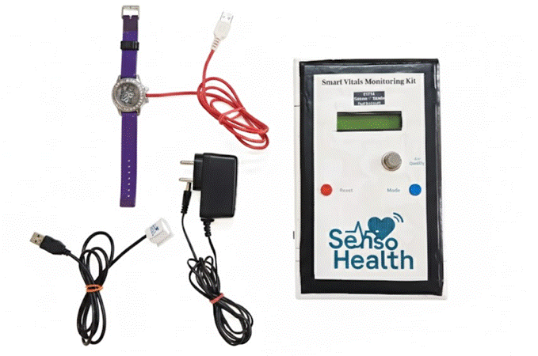

---

# Key System Capabilities

* Multi-vital sensing: ECG, SpO2, HR, Temperature, Respiration, Cuffless BP
* Sensor fusion algorithm: ECG + PPG + Motion + Environment
* AI and ML Intelligence: CNN-LSTM disease detection, BP regression, anomaly detection
* Predictive forecasting: 5–10 minute ahead estimation
* Real-time alerts: LCD display, buzzer alerts, Telegram notifications
* IoT cloud integration: Firebase, ThingSpeak, Python GUI
* Edge + Cloud hybrid processing for reliability

---

# 1. System Architecture

<details>
<summary><strong>(Click to Expand)</strong></summary>

<br>

### System Architecture Diagram
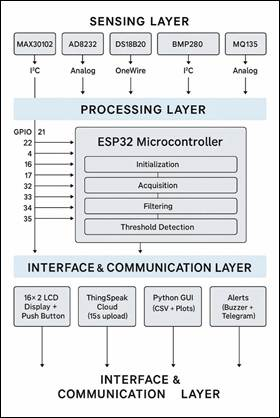

---

### System Flow Diagram
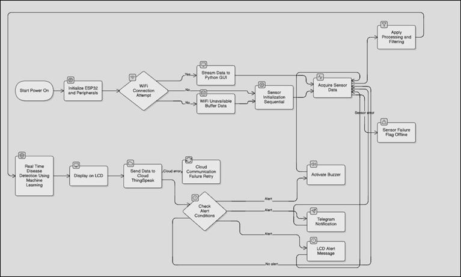

</details>

---

# 2. Hardware Overview
<details>
<summary><strong>(Click to Expand)</strong></summary>
<br>

### Sensor Placement Layout
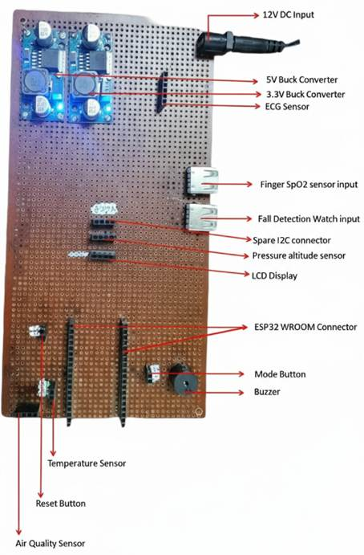

---

### Perfboard / PCB Front & Back
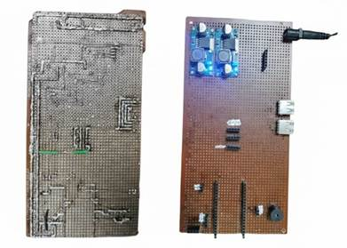

---

### Internal View (Sensor Mounting)
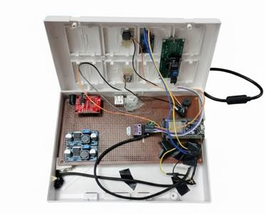

---

### Hardware Components Used

* ESP32 DevKit (38-pin)
* MAX30102
* AD8232
* DS18B20
* ADXL345
* MQ135
* BMP280
* LCD (I2C)
* Buzzer, battery, wiring

</details>

---

# 3. Software Architecture

The firmware includes data acquisition, preprocessing, feature extraction, machine learning inference, and IoT communication.
```
[Sensors] --> [Preprocessing] --> [Feature Extraction] --> [ML Inference]
                                          |                     |
                                          v                     v
                                   [Alerts System]       [Cloud / GUI Sync]

```
---

# 4. AI and ML Components

The system integrates multiple ML pipelines:

* CNN-LSTM ECG classifier
* Cuffless BP regression model
* Unsupervised anomaly detector
* Health trend forecasting
* HRV-based stress/emotion inference

### Firebase ML Analysis

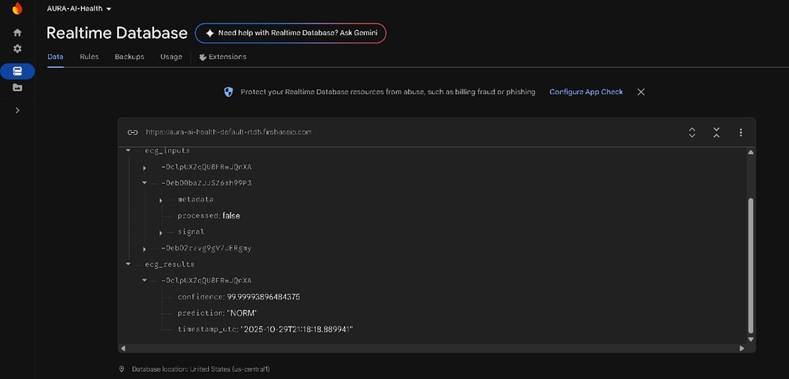

### Colab ML Model

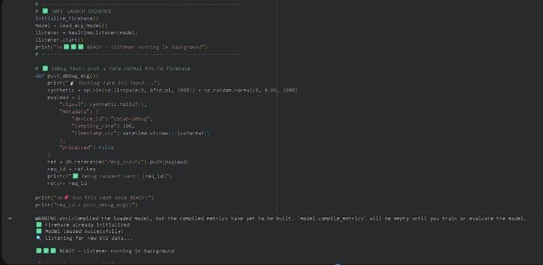

---

# 5. GUI, Cloud, and Dashboard
<details>
<summary><strong> (Click to Expand)</strong></summary>

<br>

### Python Monitoring Dashboard
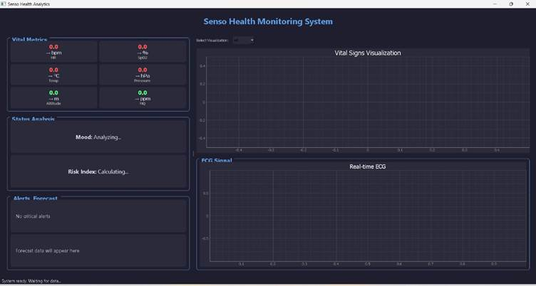

---

### ThingSpeak Cloud
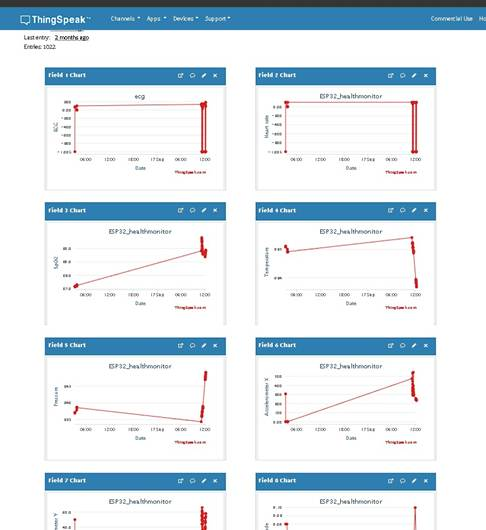

---

### Telegram Alerts
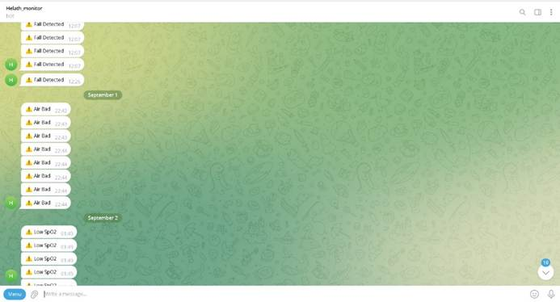

</details>

---

# 6. Test Results and Validation

The system was tested for 24-hour stability, environmental drift, fall detection, and signal quality.
<details>
<summary><strong>Test Results (Click to Expand)</strong></summary>

<br>

### 24-Hour Test
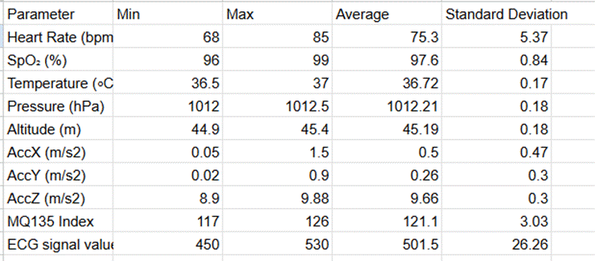

---

### Temperature Stability
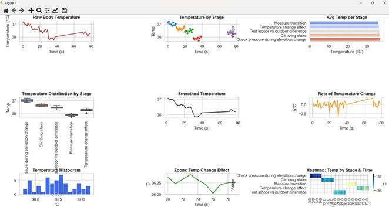

---

### Air Quality Analysis
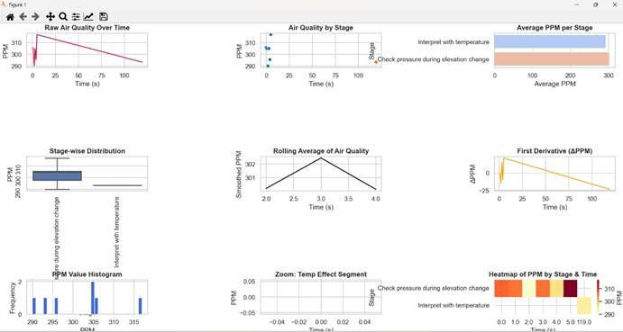

---

### Drop Test
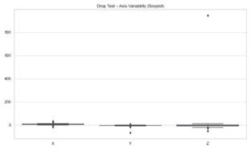

---

### Heart Rate and SpO₂ Trends
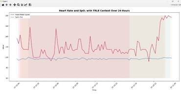

---

### Fast Swing Test
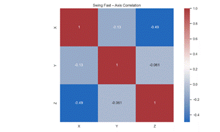

---

### Slow Swing Test
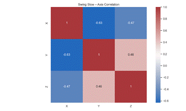

---

### ECG Signal Quality
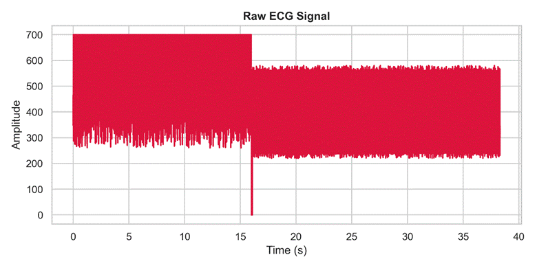

---

### Correlation Analysis
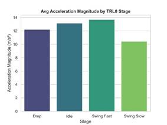

</details>

---

# 7. Components and Bill of Materials (BOM)

| S.No | Component      | Qty   | Price (INR) |
| ---- | -------------- | ----- | ----------- |
| 1    | ESP32 (38 Pin) | 1     | 354         |
| 2    | MAX30102       | 1     | 104         |
| 3    | AD8232         | 1     | 406         |
| 4    | ADXL345        | 1     | 177         |
| 5    | DS18B20        | 1     | 64          |
| 6    | MQ135          | 1     | 129         |
| 7    | Jumper wires   | 1 set | 41          |
|      | Total          |       | 1275        |

---

# 8. Pinout Table

```
add updated sooon
```

---

# 9. Pinout Diagram


---

# 10. Working Code


```
add updated soon.
```

# 11. Repository Structure (PEnding**)

```
SensoHealth/
│
├── firmware/
│   ├── esp32/
│   ├── arduino/
│   └── ml_preprocessing/
│
├── python_gui/
│   ├── dashboard.py
│   ├── requirements.txt
│
├── cloud/
│   ├── firebase/
│   ├── thingspeak/
│   └── telegram_bot/
│
├── ml_models/
│   ├── ecg_classifier/
│   ├── bp_regression/
│   ├── anomaly_detector/
│   └── dataset_samples/
│
├── hardware/
│   ├── perfboard_front.png
│   ├── perfboard_back.png
│   ├── internal_view.png
│   ├── sensor_placement.png
│
├── diagrams/
│   ├── system_architecture.png
│   ├── system_flow.png
│   └── block_diagram.png
│
├── results/
│   ├── 24hr/
│   ├── swings/
│   ├── ecg/
│
└── README.md
```

---

# 12. How to Run

### Firmware

Upload using Arduino IDE or PlatformIO.

### Python GUI

```
pip install -r requirements.txt
python dashboard.py
```

### Cloud Setup

* Update Firebase credentials
* Insert ThingSpeak API key
* Insert Telegram bot token

---

# 13. Contributors

<p align="center">
  <a href="https://github.com/Kaarmukilan17">
    
  </a>
  <a href="https://github.com/AbisekSasikumar">
    
  </a>
  
</p>

---

# 14. License